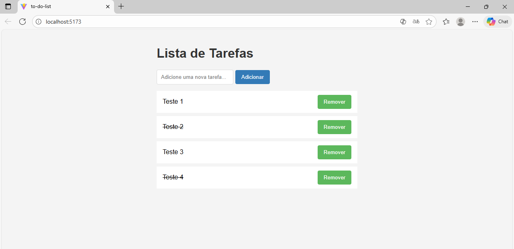

📌 To-Do-List

Gerenciador de Tarefas (To-Do List) Desenvolvi uma interface interativa para organização pessoal que permite ao usuário criar, gerenciar e excluir tarefas. O destaque da aplicação é o feedback visual de status: tarefas concluídas são marcadas instantaneamente com uma linha sobre o texto (efeito riscado), facilitando a distinção entre o que está pendente e o que já foi feito, além de permitir a remoção completa de itens desnecessários com um clique.

🚀 Tecnologias usadas: 
• React / JavaScript
• html
• css

📝 Funcionalidades

[x] Adição de Tarefas: Permite a inserção dinâmica de novos itens na lista.

[x] Controle de Conclusão: Ao clicar sobre uma tarefa, o texto recebe uma linha horizontal (tachado), indicando visualmente que a atividade foi finalizada, sem excluí-la da vista.

[x] Remoção de Itens: Possui uma função de exclusão que remove a tarefa definitivamente da lista, mantendo a interface limpa.

